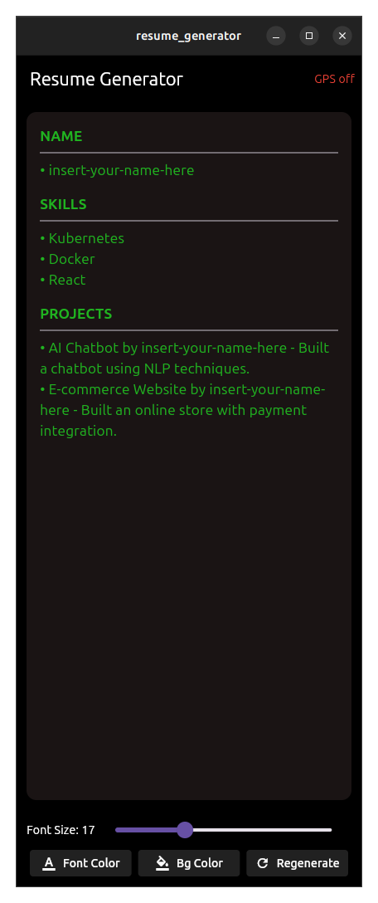

# 📱 Customizable Text Resume Generator

A Flutter app that displays resumes fetched from an API, with customizable **font size, font color, background color**, and built-in **GPS location display**.  
The app also supports **regenerating random resume data** from the API.

---

## 📸 Demo Images

<p align="center">
  
  
  
  
</p>

---

## 🎬 App Demo Videos

| 🖥️ Desktop Demo | 📱 Mobile Demo |
|-----------------|----------------|
| [](https://youtu.be/SLWTYvD0qlo) | [](https://youtube.com/shorts/Nw2BJSQQuNo?feature=share) |

> Click the thumbnails above to watch the demo videos on YouTube.
---

## 📂 Project Structure
```vbnet
lib/
  main.dart
  models/
    resume.dart
  services/
    api_service.dart
  providers/
    settings_provider.dart
    resume_provider.dart
    location_provider.dart
  screens/
    home_screen.dart
  widgets/
    color_picker_dialog.dart

```
---
## ✨ Features
- Fetch resume data from API:
  
  `https://expressjs-api-resume-random.onrender.com/resume?name=<your-name>`
- Random skills & projects generated each time (on regenerate).
- Customize:
  - Font Size (slider)
  - Font Color (picker)
  - Background Color (picker)
- Persistent settings using **Hive** (saved across restarts).
- Location support using **Geolocator** (latitude & longitude in AppBar).
- Built with **Flutter + Riverpod** for state management.

---
## ⚙️ How It Works
```
1. The app fetches a random resume from the API.
2. Resume data (name, skills, projects) is displayed in a styled card.
3. User can change:
   - Font size with a slider
   - Font & background colors using color picker
4. Preferences are saved locally with Hive, so they persist after restart.
5. Current GPS location is displayed in the AppBar.
6. Pressing "Regenerate" fetches a new random resume.

```
---

## 📱 Android Permissions

Add these permissions in android/app/src/main/AndroidManifest.xml:
```xml
<uses-permission android:name="android.permission.ACCESS_FINE_LOCATION"/>
<uses-permission android:name="android.permission.ACCESS_COARSE_LOCATION"/>
```
---
## 📦 Packages Used
```
flutter_riverpod
 – state management

hive
 + hive_flutter
 – local storage

http
 – API requests

geolocator
 – GPS/location

flutter_colorpicker
 – color selection

```
---
## 🛠️ Installation & Setup

### 1. Clone the repository & install dependencies
```bash
git clone https://github.com/<your-username>/<your-repo-name>.git
cd resume_generator
flutter pub get
```
### 2. Run the app on an emulator or device
```bash
flutter run
```


